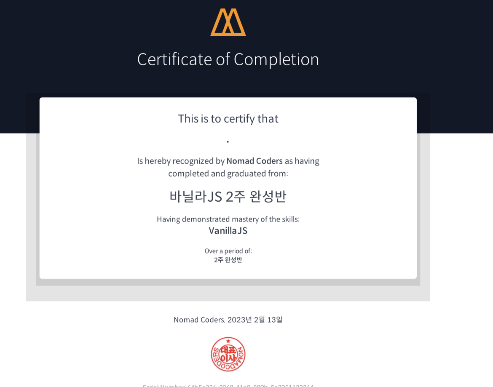

# Vanilla JS 5주 완성😎

### 스터디 비대면 모임 장소

- <a href="https://zep.us/play/23VbEW" target="_blank">ZEP 스터디 공간(비밀번호 7777)</a>

### 목표:

- 노마드코더 JS 무료강의 100% 이수(3주) + JS 챌린지 33기 성공(2주)

### 기간:

- 2023\. 1. 2.(월) ~ 2. 6.(월) (총 5주, 모임: 매주 목요일 21:00 ~ 22:00)

### 참가자:

- eunseo, 교사H, 기무1, 김진희, 뀨쌤, 두두두두두두둥, 듀비듀밥, 민트향기, 브루노마르스, 손현준, 옐로씨드, 죠이, 주선, 폴짝스, 호로롱, 홍동(총 15명)

### 스터디 자료:

- <a href="https://nomadcoders.co/javascript-for-beginners" target="_blank">바닐라 JS로 크롬 앱 만들기(노마드코더 JS 무료강의)</a>

- <a href="https://nomadcoders.co/vanillajs-challenge" target="_blank">바닐라JS 챌린지(노마드코더 JS 챌린지)</a>

---

## [1주차](<https://teacher-kiwi.github.io/study-together/(2023.01.)vanilla-js/week1>)

### 강의 듣기

- #1 [2021 UPDATE] INTRODUCTION

- #2 [2021 UPDATE] WELCOME TO JAVASCRIPT

- #3 [2021 UPDATE] JAVASCRIPT ON THE BROWSER

### 과제

- DOM을 활용하여 각종 Event가 발생했을 때 동적인 페이지 만들기

---

## [2주차](<https://teacher-kiwi.github.io/study-together/(2023.01.)vanilla-js/week2>)

### 강의 듣기

- #4 [2021 UPDATE] LOGIN

- #5 [2021 UPDATE] CLOCK

- #6 [2021 UPDATE] QUOTES AND BACKGROUND

### 과제

- 로그인, 시계, 명언과 배경 기능을 완성하고 자기만의 업그레이드하기

---

## [3주차](<https://teacher-kiwi.github.io/study-together/(2023.01.)vanilla-js/week3>)

### 강의 듣기

- #7 [2021 UPDATE] TO DO LIST

- #8 [2021 UPDATE] WEATHER

### 과제

- 투두리스트, 날씨 기능 완성하고 자기만의 업그레이드하기

---

## [4, 5주차](<https://teacher-kiwi.github.io/study-together/(2023.01.)vanilla-js/week4-5>)

- 1월 22일 (일) 자정까지 챌린지 신청하기

- 매일매일 챌린지 참여하기

- 질문 및 의견 공유

- 챌린지 도전 성공하기!

---

## 수료증

### 기무1, 두두두두두두둥, 주선, 폴짝스

